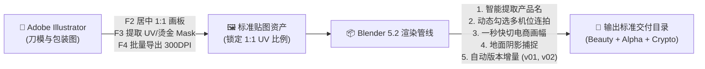

# 📦 Packaging Render Pipeline (3D包装渲染与多通道自动输出管线)

[](https://www.blender.org/)
[](https://www.adobe.com/products/illustrator.html)
[](LICENSE)

专为 **商业包装设计、3D 产品渲染与电商视觉工业化流程** 打造的全链路自动化工具套件。
打通从 **Adobe Illustrator 矢量刀模/贴图提取** 到 **Blender 5.2 LTS 智能命名、多机位连拍、阴影捕捉与多通道合成导出** 的完整管线。

---

## 🚀 核心功能与痛点解决



### 1. Adobe Illustrator 自动化脚本套件
* **`01_Auto_1to1_Square_Artboard.jsx` (快捷键 F2)**：自动计算选中包装元素最大边界，生成完美居中的 1:1 正方形画板，锁死 3D 贴图 UV 比例，杜绝拉伸变形。
* **`02_Extract_UV_Foil_Mask.jsx` (快捷键 F3)**：原位提取局部 UV 光油、烫金/金属工艺，自动生成纯黑底白图的高精遮罩 Mask。
* **`03_Batch_Export_Textures.jsx` (快捷键 F4)**：一键批量导出所有画板为 300 PPI 高清透明 PNG。

### 2. Blender 5.2 LTS 包装渲染与多通道输出插件 (v2.0.2)
* **🏷️ 智能目录产品名识别**：自动穿透并识别工程目录层级（如 `D:\Projects\Beverage_Brand\Orange_Soda_Can\Renders` -> 自动提取产品名 **`Orange_Soda_Can`**），无需手动输入。
* **📸 动态勾选多机位批量连拍**：智能列出场景中所有摄像机，支持单独勾选、全选/反选与一键 📷 视角预览。
* **⚡ 异步事件接力渲染（告别卡死）**：采用非阻塞队列与原生定时器，实时弹出渲染窗口显示采样跳动（`1/1024`）与降噪进度，多机位自动顺序接力，界面永远不卡死。
* **📐 电商画幅与采样率快切**：一键切换 1:1（2000×2000 主图）、3:4（竖版）、16:9（横版）与 64预览 / 1024高清交付。
* **🔘 地面阴影捕捉一键开关**：一键将所选地面设为 Shadow Catcher，确保输出纯净的产品 Alpha 剪切蒙版。
* **🔢 自动版本增量防覆盖**：多次渲染自动递增 `_v01`、`_v02`... 绝不冲掉旧图。
* **🎨 自适应调色与通道分流**：完美兼容 `Render Raw` 等色调映射插件，输出带透明通道的 Beauty 成品、Alpha 剪切蒙版与 Cryptomatte 选区。

---

## 🛠️ 安装与使用指南

### 一、Adobe Illustrator 脚本安装
1. 将 `illustrator-scripts/` 下的 3 个 `.jsx` 脚本复制到 Illustrator 脚本目录：
   * **Windows**: `C:\Program Files\Adobe\Adobe Illustrator <版本>\Presets\zh_CN\脚本\`
2. 重启 Illustrator，可在 `文件 > 脚本` 菜单中找到。
3. （推荐）在「动作」面板中为它们绑定快捷键：`F2` (1:1画板)、`F3` (提取遮罩)、`F4` (批量导出)。

### 二、Blender 5.2 插件安装
1. 打开 Blender 5.2，进入 `编辑 > 偏好设置 > 扩展/插件`；
2. 点击右上角下拉菜单选择 **`从磁盘安装... (Install from Disk...)`**；
3. 选择 `blender-addon/Packaging_Render_Pipeline_Blender5.zip` 即可安装启用；
4. 在 3D 视口按 **`N`** 键，在右侧标签栏找到 **`【包装渲染】`** 面板。

---

## 📂 自动化输出目录结构示例

```text
📁 Orange_Soda_Can/渲染/
├── 📄 Orange_Soda_Can_v01_Camera_正面_01_Beauty_成品.png
├── 📄 Orange_Soda_Can_v01_Camera_正面_02_Mask_Alpha蒙版.png
├── 📄 Orange_Soda_Can_v01_Camera_正面_03_Crypto_选区.png
│
├── 📄 Orange_Soda_Can_v01_Camera_45度_01_Beauty_成品.png
├── 📄 Orange_Soda_Can_v01_Camera_45度_02_Mask_Alpha蒙版.png
└── 📄 Orange_Soda_Can_v01_Camera_45度_03_Crypto_选区.png
```

---

## 📄 开源协议
本项目采用 [MIT 许可证](LICENSE)。